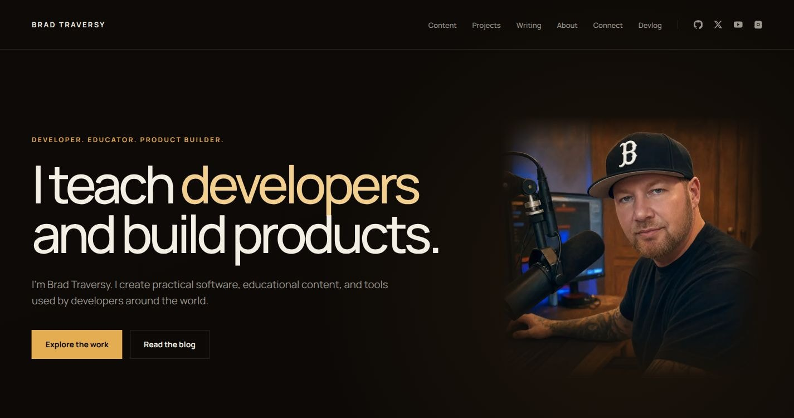

# bradtraversy.com

The personal portfolio and writing site for Brad Traversy. It brings together
education work, software projects, and long-form articles in a focused static
site.



## Features

- Responsive portfolio homepage with education, project, writing, and contact
  sections
- Repository-backed project and writing collections with build-time validation
- Static project case studies and internal MDX article pages
- Support for writing hosted locally or linked to an external publication
- Optimized local images, accessible navigation, visible focus states, and
  reduced-motion support

## Built with

- [Astro](https://astro.build/)
- TypeScript
- Astro content collections
- MDX
- Plain CSS
- pnpm

## Local development

Requires Node.js 22.12 or newer and pnpm.

```bash
pnpm install
pnpm dev
```

The development server runs at `http://localhost:4321`.

## Commands

| Command | Description |
| --- | --- |
| `pnpm dev` | Start the Astro development server |
| `pnpm build` | Create the production build in `dist/` |
| `pnpm preview` | Preview the production build locally |
| `pnpm astro -- <command>` | Run an Astro CLI command |

## Project structure

```text
src/
  assets/       Local images processed by Astro
  components/   Shared page and content components
  content/      Project and writing collections
  data/         Site-wide configuration and structured data
  layouts/      Shared document layouts
  pages/        Static routes and dynamic collection routes
  styles/       Global design tokens and shared styles
```

Project planning, active feature context, and completed feature history live in
the `blueprint/` directory.
