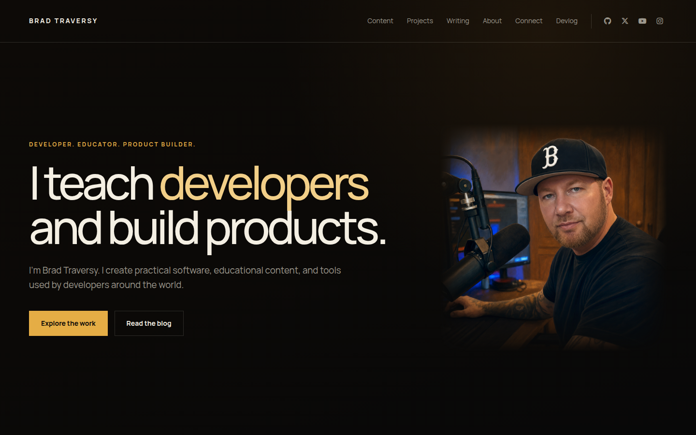

# Feature: Visual foundation and site shell

**From build-plan:** feature 1
**Status:** complete

## Goal

Establish the reusable visual and structural foundation for every bradtraversy.com
page. The feature delivers the approved palette and typography, global layout
rules, shared page metadata, desktop and mobile navigation, footer, and only the
shell primitives that later features will use.

## Design reference



Use this reference for the palette, typography, content width, header proportions,
nav treatment, rules, spacing rhythm, and overall restraint. The portrait and hero
content shown in the image belong to Feature 2 and are not part of this feature.

## In scope

- Global CSS tokens for the approved black, warm brown, bone, muted, gold, line,
  width, spacing, type, focus, and reduced-motion foundations
- Manrope delivered locally rather than loaded from a third-party font request
- A reusable page shell and content-width primitive
- A shared `BaseLayout` with language, charset, viewport, favicon, title,
  description, and body structure
- Repository-owned site, primary-navigation, and header-social configuration
- A desktop header with brand, primary links, and accessible social links
- A responsive mobile menu with keyboard and pointer behavior
- A minimal shared footer matching the approved direction
- Replacement of the Astro starter page with a small shell preview that proves
  the shared layout without implementing the real homepage

## Out of scope

- Homepage hero, portrait, credibility strip, education, projects, writing, about,
  social grid, or contact sections, all deferred to Feature 2
- Project and writing content collections or their routes, deferred to Features
  3 through 6
- Final public copy, verified content facts, and production media, deferred to
  Feature 7
- Canonical URLs, social cards, sitemap, RSS, robots rules, 404 handling, and
  performance hardening, deferred to Feature 8
- Vercel configuration, domain redirects, deployment, or launch smoke testing,
  deferred to Feature 9
- A contact form, analytics, UI framework, styling library, CMS, API, database,
  authentication, or unit test runner
- Copying the standalone prototype wholesale into the Astro application

## Build loop

Build one step at a time, never the whole feature at once.

1. Plan mode lays out the step before any code.
2. The AI implements just that step.
3. It shows the diff, not full files; Brad reads and understands it.
4. Brad approves, then chooses whether to commit a checkpoint or continue.
   Checkpoints are optional; `/complete` creates the feature-level commit.

Never accept a step that has not been reviewed. If a diff is too big to review,
split the step before continuing.

## Build steps

- [x] **Step 1 - Port the visual foundation** - add `@fontsource/manrope` with
  only the approved weights, create and import the global stylesheet from the
  starter page, lock the approved color and layout tokens, and add base element,
  focus, image, and reduced-motion rules. *Done when:* the starter page renders
  with the approved background, bone text, Manrope type, visible keyboard focus,
  and shared content width, with no remote font or icon request and a passing
  `pnpm build`.
- [x] **Step 2 - Create the layout and site contracts** - add the typed site,
  navigation, and social-link configuration plus `BaseLayout`, then move document
  metadata, favicon links, global styles, and the page slot into that layout.
  *Done when:* `src/pages/index.astro` uses `BaseLayout`, its document title and
  description come through typed props, the initial site contracts match the
  Data / contracts section, and `pnpm build` passes.
- [x] **Step 3 - Build the desktop shell** - add the shared header, minimal footer,
  content-width treatment, and inline accessible social icons, then integrate them
  through `BaseLayout`. *Done when:* a 1440 by 900 browser view matches the
  reference's header proportions, spacing, palette, brand, nav, rules, and icon
  treatment; the footer uses the same system; every link has an accessible name;
  the current internal route exposes `aria-current` when applicable; and
  `pnpm build` passes.
- [x] **Step 4 - Add responsive navigation and finish the handoff** - add the
  mobile menu and its minimal client-side behavior, responsive header and footer
  rules, and a restrained shell-preview main area. *Done when:* at widths of 760px
  and 375px the desktop links collapse into one menu button; the menu opens and
  closes by pointer, Enter or Space, Escape, outside click, and link selection;
  state resets when the viewport returns to desktop; navigation links remain
  reachable if the enhancement script does not execute; `aria-expanded` and the
  accessible label stay accurate; focus remains visible; no console errors
  appear; desktop and mobile screenshots are captured; and `pnpm build` passes.

## Files / areas

- `package.json` and `pnpm-lock.yaml` for local Manrope delivery
- `src/styles/global.css`
- `src/data/site.ts`
- `src/layouts/BaseLayout.astro`
- `src/components/SiteHeader.astro`
- `src/components/SiteFooter.astro`
- `src/components/SocialIcon.astro`
- `src/pages/index.astro`
- `blueprint/reference/feature-1-homepage.png`

Create another component only when the shell uses it immediately. Do not build a
speculative component library for later pages.

## Data / contracts

The feature establishes the first repository-owned subset of `SiteConfig` from
the project overview. Later features may extend it, but they should not rename or
redefine these fields without updating the overview.

```ts
interface NavItem {
  label: string;
  href: string;
  external: boolean;
}

interface SocialLink {
  name: string;
  label: string;
  url: string;
  icon: "github" | "x" | "youtube" | "instagram";
}

interface SiteConfig {
  name: string;
  description: string;
  navigation: NavItem[];
  socialLinks: SocialLink[];
}

interface BaseLayoutProps {
  title: string;
  description: string;
}
```

The production `siteUrl`, canonical hostname, contact address, education
platforms, credibility facts, and full SEO object remain unset because their
source decisions or owning features have not landed yet.

The initial navigation values are locked to Content (`/#content`), Projects
(`/projects`), Writing (`/writing`), About (`/#about`), Connect (`/#socials`), and
Devlog (`https://bradtraversy.dev`). The initial header social links are GitHub
(`https://github.com/bradtraversy`), X (`https://x.com/traversymedia`), YouTube
(`https://www.youtube.com/@TraversyMedia`), and Instagram
(`https://www.instagram.com/traversymedia/`). Future routes and homepage anchors
become functional in their owning features; this feature locks their destinations
without implementing those pages early.

Lock these CSS custom properties in Step 1 because every later visual feature will
consume them:

```css
--color-black: #0b0907;
--color-black-soft: #14100b;
--color-bone: #f4efe3;
--color-muted: #9d988d;
--color-gold: #e5ad45;
--color-gold-soft: #f2cf88;
--color-line: rgba(244, 239, 227, 0.15);
--content-max: 82.5rem;
```

Additional spacing and typography tokens may be added when they represent repeated
values visible in the reference. Avoid tokens for one-off homepage content that
belongs to Feature 2.

## Testing

No unit test runner is configured, and this feature contains no pure business
logic that justifies adding one.

- Run `pnpm build` after every step and before approval.
- For visual checks, Brad starts `pnpm dev`; the AI does not start the dev server.
- Capture and compare a 1440 by 900 desktop view with the design reference.
- Check the responsive shell at 760px and 375px widths.
- Use keyboard-only navigation to verify visible focus, menu activation, Escape,
  link selection, and sensible tab order.
- Verify the menu's accessible name and `aria-expanded` state in both positions.
- Verify that the navigation remains reachable without the enhancement script.
- Verify reduced-motion preferences remove optional transitions.
- Check browser console output for errors after desktop and mobile interaction.

## Notes for the AI

- Use Astro components and server-rendered HTML. Do not add React, Vue, Svelte, or
  another client framework.
- Keep client JavaScript limited to the mobile-menu behavior. Do not hydrate the
  whole header.
- Use `@fontsource/manrope` for weights 400, 500, 600, and 700, plus inline SVG
  social icons. Do not copy the prototype's Google Fonts or Font Awesome CDN links.
- Treat the reference as the visual target for the shell, not permission to build
  the Feature 2 homepage early.
- Do not start the dev server. Ask Brad to run `pnpm dev` when browser evidence is
  needed.
- Stop after each build step and show the reviewable diff before continuing.
- Preserve the repository's no em dash, no en dash, and no ellipsis rules in code,
  comments, content, and commit messages.
