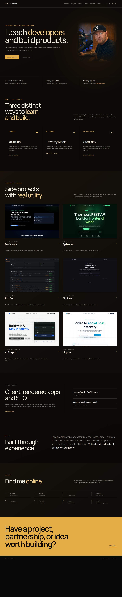

# Feature: Portfolio homepage

**From build-plan:** feature 2
**Status:** complete

## Goal

Replace the temporary shell preview with the approved portrait-led portfolio
homepage. The page should explain who Brad is, establish credibility, present his
education platforms and selected software work, preview writing and background,
and provide clear paths to social channels, professional contact, and the detailed
bradtraversy.dev devlog.

## Design reference



The durable screenshot was captured from the approved local prototype at
`/home/brad/.codex/visualizations/2026/07/25/019f98d0-887e-71e2-a556-09e72e2be0fb/bradtraversy-com-design-options/studio-index-refined.html`.
Use the screenshot for section order, proportions, typography, spacing, image
treatment, borders, and responsive intent. Reuse the Feature 1 shell rather than
copying the prototype header, footer, remote fonts, icons, or menu script.

## In scope

- Homepage-specific repository data and typed contracts for education platforms,
  credibility facts, selected project previews, writing previews, and social
  connections
- Local copies of the approved prototype portrait and six project images, loaded
  through Astro's image pipeline
- Portrait-led hero with eyebrow, editorial headline, introduction, and working
  in-page calls to action
- Three-item credibility strip, including the bradtraversy.dev path
- Education platform section for YouTube, Traversy Media, and Start.dev
- Six selected project cards matching the approved two-column gallery
- Featured writing preview plus two supporting writing rows
- About statement, expanded social connection grid, and a gold professional CTA
- Responsive layouts at desktop, 760px, and 375px without adding client JavaScript
- Accessible headings, link names, alt text, focus states, and reduced-motion-safe
  hover treatment

## Out of scope

- Project content collections, the `/projects` index, and project detail routes,
  which belong to Features 3 and 4
- Writing collections, the `/writing` index, and internal article routes, which
  belong to Features 5 and 6
- Final fact checking, final public copy, final production media, the permanent
  professional email address, and exhaustive external-link verification, which
  belong to Feature 7
- Canonical URLs, social cards, sitemap, RSS, robots rules, 404 handling, and
  performance hardening, which belong to Feature 8
- Deployment, analytics, forms, a CMS, a database, or a UI framework
- Reworking the shared header, footer, or mobile-menu behavior unless a homepage
  integration defect is proven

## Build loop

Autopilot builds and verifies one reviewable step at a time. Every passing step is
checked off and committed as its own checkpoint on the feature branch. The run
stops before `/complete`, merge, push, or deployment.

## Build steps

- [x] **Step 1 - Add homepage contracts and local media** - extend the repository
  data contracts with `EducationPlatform` and `CredibilityFact`, add typed
  homepage preview data for projects, writing, and connection links, expand the
  icon keys needed by that data, and copy only the seven prototype images used by
  the homepage into `src/assets/home/`. *Done when:* every homepage card and
  section can render from typed repository data, all image imports resolve
  locally, header behavior remains unchanged, no remote font or icon dependency
  is introduced, and `pnpm build` passes.
- [x] **Step 2 - Build the hero and credibility strip** - add the portrait-led
  hero and three proof items, replace the temporary shell preview at the top of
  `/`, and keep both hero actions on working destinations that exist now.
  *Done when:* the 1440px hero matches the approved headline, portrait, spacing,
  palette, buttons, and proof strip; the portrait stacks cleanly at 375px; the
  hero links reach `#content` and `#writing`; semantic headings and portrait alt
  text are present; and `pnpm build` passes.
- [x] **Step 3 - Build the education platform section** - add the section heading,
  supporting copy, three data-driven platform cards, local inline icons, and
  external-link treatment. *Done when:* the desktop row and mobile stack match the
  reference, every card has a unique accessible destination, focus remains
  visible, no Font Awesome request is made, and `pnpm build` passes.
- [x] **Step 4 - Build the selected projects gallery** - add the warm project
  surface and six data-driven project cards using Astro `Image`, approved media,
  alt text, type labels, descriptions, and external product destinations.
  *Done when:* cards render as a balanced two-column gallery at 1440px and one
  column at 375px, all six images expose valid dimensions and link labels in the
  rendered output, hover motion is restrained by reduced-motion rules, no image
  request fails, and `pnpm build` passes.
- [x] **Step 5 - Build writing and about sections** - add the featured writing
  composition, two supporting rows, and the two-column about statement while
  keeping all preview links on current external destinations until the writing
  collection exists. *Done when:* both sections match the reference hierarchy,
  stack cleanly below 760px, expose one `h2` per section, contain no dead local
  route, and `pnpm build` passes.
- [x] **Step 6 - Build social connections, professional CTA, and final responsive
  pass** - add the expanded connection grid, use an approved public social
  destination for the professional CTA without choosing the permanent contact
  email early, then finish section spacing and responsive behavior across the
  complete page. *Done when:* all planned sections appear once and in reference
  order; `#content`, `#projects`, `#writing`, `#about`, and `#socials` resolve;
  external links are accessible and deliberate; screenshots at 1440px, 760px,
  and 375px show no horizontal overflow or clipped content; keyboard navigation
  remains usable; no application console error or failed local asset request is
  present; and `pnpm build` passes.

## Files / areas

- `blueprint/reference/feature-2-homepage.png`
- `src/assets/home/`
- `src/data/site.ts`
- `src/data/home.ts`
- `src/components/SocialIcon.astro`
- `src/components/HomeHero.astro`
- `src/components/HomeProof.astro`
- `src/components/EducationPlatforms.astro`
- `src/components/PlatformIcon.astro`
- `src/components/SelectedProjects.astro`
- `src/components/FeaturedWriting.astro`
- `src/components/AboutSection.astro`
- `src/components/SocialConnections.astro`
- `src/components/ContactCta.astro`
- `src/pages/index.astro`

Create another component only if it is used immediately and keeps a listed step
reviewable. Do not introduce a general component library.

## Data / contracts

Feature 2 extends the repository-owned homepage data without locking the future
project or writing collection schemas.

```ts
interface EducationPlatform {
  name: string;
  label: string;
  description: string;
  url: string;
  order: number;
  icon: "youtube" | "graduation" | "code";
}

interface CredibilityFact {
  value: string;
  description: string;
  url?: string;
}

interface HomepageProject {
  title: string;
  type: string;
  summary: string;
  url: string;
  image: ImageMetadata;
  alt: string;
}

interface HomepageArticle {
  title: string;
  topic: string;
  dateLabel: string;
  summary?: string;
  url: string;
  featured: boolean;
}

interface ConnectionLink {
  name: string;
  handle: string;
  label: string;
  url: string;
  icon: "youtube" | "github" | "x" | "linkedin" | "instagram" | "facebook" | "patreon";
}
```

`EducationPlatform` and `CredibilityFact` extend `SiteConfig` because later
homepage revisions consume them. `HomepageProject` and `HomepageArticle` are
explicit preview shapes, not substitutes for the `ProjectEntry` and
`WritingEntry` collection schemas owned by Features 3 and 5.

The professional CTA links to Brad's documented LinkedIn profile for now. Feature
7 owns the decision about a permanent public contact email and may replace that
destination after verification.

## Testing

No test command is declared in `AGENTS.md`, and this feature adds static UI and
repository data rather than pure business logic.

- Run `pnpm build` after every step and before each checkpoint commit.
- Reuse the already-running Astro server instead of starting another one.
- Capture `/` at 1440 by 900, 760 by 900, and 375 by 812.
- Compare the page against `blueprint/reference/feature-2-homepage.png` section by
  section rather than expecting the full long page to fit one viewport.
- Verify all required anchor IDs, unique heading IDs, image alt text, and external
  link names in the rendered DOM.
- Exercise hero, platform, project, writing, social, CTA, and mobile-menu links.
- Check keyboard focus order and confirm reduced-motion disables optional motion.
- Check the browser console and failed network requests after desktop and mobile
  traversal.
- Confirm no remote font, Font Awesome, or prototype asset request appears.

## Notes for the AI

- Preserve the Feature 1 header, footer, content width, metadata, and mobile-menu
  contracts.
- Use Astro components, server-rendered HTML, plain CSS, and local image imports.
- Use the approved prototype as the visual target, not as production-ready factual
  authority. Feature 7 still owns public fact, copy, media, and link verification.
- Keep project and writing preview data deliberately separate from the future
  content collection contracts.
- Do not choose or publish a permanent professional email address in this feature.
- Do not add React, Vue, Svelte, a styling library, remote fonts, Font Awesome, or
  new client JavaScript.
- Preserve the repository's no em dash, no en dash, and no ellipsis rules in code,
  comments, content, checkpoint messages, and docs.
