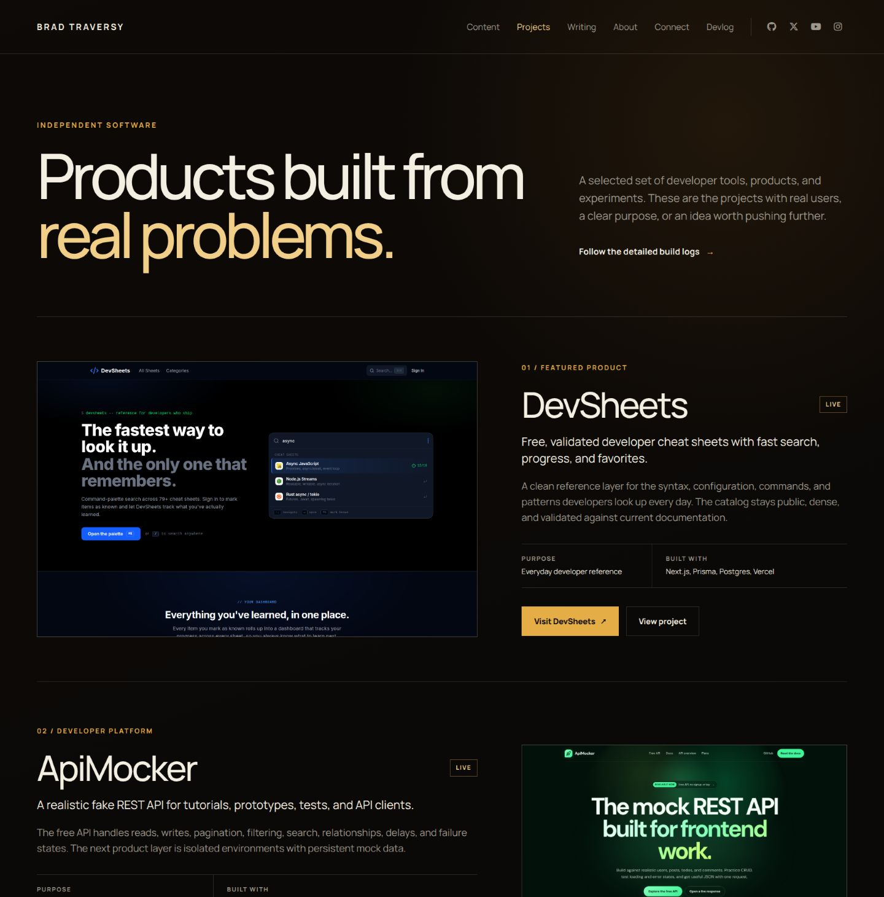

# Feature: Project collection and index

**From build-plan:** feature 3
**Status:** complete

## Goal

Establish the validated, repository-backed project collection and build the
approved `/projects` index. The page should separate two featured projects from
the broader four-project catalog while giving every entry a clear live-product
or devlog destination.

This feature replaces the temporary homepage project-preview records with the
shared collection that Feature 4 will use for project detail routes.

## Design reference



The durable screenshot was captured from the approved local prototype at
`/home/brad/.codex/visualizations/2026/07/25/019f98d0-887e-71e2-a556-09e72e2be0fb/bradtraversy-com-design-options/studio-projects.html`.
Use the screenshot for page hierarchy, featured-project alternation, catalog
cards, image treatment, facts, status labels, spacing, and responsive intent.
Reuse the production shell, local Manrope files, focus rules, icons, and mobile
menu rather than copying the prototype header, footer, remote resources, or
script.

## In scope

- Astro 7 content-layer configuration for a `projects` collection loaded from
  repository Markdown files
- A validated collection schema that locks the shared project, media, capability,
  sorting, and link contracts needed by Features 3 and 4
- Six curated initial entries: DevSheets, ApiMocker, SkillPass, PortDoc,
  AI Blueprint, and Vidpipe
- Two featured entries, DevSheets and ApiMocker, followed by four additional
  projects in intentional order
- Migration of the six project images from homepage-specific storage to
  project-owned local assets
- Migration of the homepage selected-project gallery from temporary preview data
  to the shared collection
- A data-driven `/projects` route with an editorial page hero, alternating
  featured projects, additional-project cards, and the bradtraversy.dev archive
  callout
- Project status, type, role, tagline, summary, stack, live URL, optional devlog
  URL, media, future gallery data, and future capability data
- Responsive layouts at 1440px, 760px, and 375px without new client JavaScript
- Accessible headings, link names, alt text, focus states, and reduced-motion-safe
  image treatment

## Out of scope

- `/projects/[slug]` routes, case-study rendering, narrative sections, media
  galleries, related notes, or next-project navigation, which belong to Feature 4
- Choosing which projects receive full launch case studies, which remains an open
  content decision for Feature 4
- Adding projects beyond the approved six-entry initial catalog
- Search, filtering, tags, pagination, sorting controls, or a CMS
- Final fact checking, final public copy, definitive status labels, final stack
  lists, and exhaustive external-link verification, which belong to Feature 7
- Canonical URLs, social cards, sitemap handling, and performance hardening,
  which belong to Feature 8
- Reworking the shared header, footer, homepage composition, or mobile navigation
  beyond the project-data migration needed to remove duplication
- Adding MDX integration before a case study requires MDX-specific behavior

## Build loop

Build one step at a time, never the whole feature at once.

1. Plan mode lays out the step before any code.
2. The AI implements just that step.
3. It shows the diff, not full files; Brad reads and understands it.
4. Brad approves, then chooses whether to commit a checkpoint or continue.
   Checkpoints are optional; `/complete` creates the feature-level commit.

Never accept a step that has not been reviewed. If a diff is too big to review,
split the step before continuing.

## Build steps

- [x] **Step 1 - Lock the project collection contract** - add
  `src/content.config.ts`, the Astro `glob` loader, the project schema, and a
  small repository helper that returns entries in stable display order.
  Treat the Astro entry `id` as the unique project slug and keep collection
  bodies available for Feature 4. *Done when:* generated Astro types expose the
  `projects` collection; required strings, URLs, arrays, local images, status,
  feature flag, and order values are build-time validated; gallery and
  capabilities default to empty arrays; the helper returns featured and
  additional groups in ascending order; `pnpm astro -- sync` passes; and
  `pnpm build` passes.
- [x] **Step 2 - Seed the curated project catalog** - add one Markdown entry per
  approved project, reference the six existing local product images, and fill
  every required frontmatter field from the approved prototype while leaving
  full case-study bodies for Feature 4.
  *Done when:* the collection contains exactly six unique entries; DevSheets and
  ApiMocker are the only featured entries; the other four appear in the approved
  order; every hero image resolves through Astro's image schema with descriptive
  alt text; an omitted optional devlog URL produces no empty link; no duplicate
  entry or display order exists within either project group; and `pnpm build`
  passes.
- [x] **Step 3 - Move project media and the homepage gallery onto the
  collection** - move the six images from homepage-specific storage into
  `src/assets/projects/`, update the collection image references, remove the
  temporary `HomepageProject` contract and image imports from `src/data/home.ts`,
  then load and render the six sorted collection entries in
  `SelectedProjects.astro` without changing the approved homepage composition.
  *Done when:* the homepage and future project routes consume the same titles,
  summaries, links, order, and hero media; the homepage still renders six cards
  in its approved order at 1440px and 375px; no project record exists in both
  `home.ts` and the collection; and `pnpm build` passes.
- [x] **Step 4 - Build the project-index hero and route composition** - add
  `/projects`, compose it through `BaseLayout`, and build the editorial hero with
  its eyebrow, headline, supporting copy, and external build-log path.
  *Done when:* `/projects` returns a complete document through the shared shell;
  the Projects navigation item exposes `aria-current="page"`; the hero matches
  the approved desktop and mobile hierarchy; its devlog destination is named and
  external; the page has one `h1`; and `pnpm build` passes.
- [x] **Step 5 - Build the featured project presentation** - render the two
  featured collection entries as alternating image-and-copy rows with sequence
  labels, status, tagline, summary, role and stack facts, and deliberate live and
  optional devlog actions. *Done when:* DevSheets renders first and ApiMocker
  second; the desktop rows alternate media placement and stack media first below
  1050px; all images expose valid dimensions and alt text; no link targets a
  missing local detail route; missing optional devlog data removes that action;
  visible focus and reduced-motion rules cover every interactive treatment; and
  `pnpm build` passes.
- [x] **Step 6 - Build the additional catalog and final responsive pass** - render
  the four non-featured entries in the approved grid, add local inline project
  icons, stack labels, optional devlog links, and the final curated-archive
  callout, then finish full-page responsive behavior. *Done when:* the additional
  catalog contains exactly SkillPass, PortDoc, AI Blueprint, and Vidpipe in
  approved order; the grid is two columns at 1440px and one column at 760px and
  375px; every external link has an accessible name and deliberate target
  behavior; screenshots at all three widths show no overflow or clipped content;
  no remote font, icon, or image request appears; no application console error or
  failed local asset request is present; and `pnpm build` passes.

## Files / areas

- `blueprint/reference/feature-3-project-index.jpg`
- `src/content.config.ts`
- `src/content/projects/`
- `src/assets/projects/`
- `src/lib/projects.ts`
- `src/data/home.ts`
- `src/components/SelectedProjects.astro`
- `src/components/ProjectsHero.astro`
- `src/components/FeaturedProjects.astro`
- `src/components/ProjectCatalog.astro`
- `src/components/ProjectArchiveCta.astro`
- `src/components/ProjectIcon.astro`
- `src/pages/projects/index.astro`

Create another component only when the project index uses it immediately. Keep
`src/pages/projects/index.astro` as the route composer, keep repeated project
records in the collection, and do not create one-off card components whose only
job is to move markup out of its owning section.

## Data / contracts

Feature 3 locks the collection contract consumed by both the index and Feature 4.
The Markdown filename becomes the Astro entry `id` and canonical slug, so a
separate frontmatter slug cannot drift from the route segment.

```ts
type ProjectIconName =
  | "reference"
  | "api"
  | "shield"
  | "network"
  | "workflow"
  | "video";

interface MediaAsset {
  src: ImageMetadata;
  alt: string;
  caption?: string;
}

interface Capability {
  title: string;
  description: string;
}

interface ProjectData {
  title: string;
  status: string;
  type: string;
  role: string;
  tagline: string;
  summary: string;
  stack: string[];
  liveUrl: string;
  devlogUrl?: string;
  featured: boolean;
  order: number;
  icon: ProjectIconName;
  hero: MediaAsset;
  gallery: MediaAsset[];
  capabilities: Capability[];
}
```

Implement the collection with Astro 7's current content layer:

```ts
import { defineCollection } from "astro:content";
import { glob } from "astro/loaders";
import { z } from "astro/zod";
```

`ProjectEntry` is `CollectionEntry<"projects">`; its `id` is the `slug` described
by the project overview, and its body is the future case-study narrative. The
schema uses the collection `image()` helper for every `MediaAsset.src` and Zod
URL validation for external destinations. `tagline` is the concise display
headline used by the project index, while `summary` is the longer description
available to lists and future detail pages. `status` remains a required,
non-empty string until Feature 7 confirms the final public labels.

The repository helper rejects duplicate `order` values within either the
featured or additional group so a content edit cannot create an ambiguous
layout.

Feature 3 does not generate internal project routes. Until Feature 4 creates a
case study, project media, titles, and primary actions resolve to `liveUrl`.
`devlogUrl` is optional and its action is omitted when absent. No placeholder
local route may be rendered.

## Testing

No test command is declared in `AGENTS.md`. The feature adds build-time content
validation, static rendering, and simple stable ordering rather than enough pure
application logic to justify silently adding a test runner.

- Run `pnpm astro -- sync` after the schema and entries change.
- Run `pnpm build` after every step and before each checkpoint.
- Confirm malformed required fields, invalid URLs, and unresolved images fail
  Astro's content validation rather than rendering partial cards.
- Confirm the built output contains exactly six projects, two featured and four
  additional, in the approved order.
- Compare `/projects` with `blueprint/reference/feature-3-project-index.jpg`.
- Capture `/projects` at 1440 by 900, 760 by 900, and 375 by 812.
- Verify one `h1`, unique heading IDs, current-route navigation state, image alt
  text, and external link names in the rendered DOM.
- Check homepage regression at `/` after migrating its project data.
- Check keyboard focus, reduced-motion CSS, the browser console, and local asset
  loading after desktop and mobile traversal.
- Confirm no `/projects/[slug]` link exists before Feature 4 creates that route.

## Notes for the AI

- Preserve the Feature 1 shell and Feature 2 homepage design.
- Use Astro content collections, server-rendered HTML, plain CSS, and local image
  imports. Add no client JavaScript for this feature.
- Keep page-level composition in the route and meaningful visual sections in
  components. Do not split every individual card into a component.
- Use the approved project-index prototype as visual guidance, not as final
  factual authority. Feature 7 still owns public fact, status, stack, copy,
  media, and external-link verification.
- Sort by numeric `order` inside the featured and additional groups. Do not rely
  on filesystem order.
- Preserve optionality. An absent `devlogUrl`, gallery, or capability list must
  not create empty UI or a dead destination.
- Keep project bodies available but do not write or render full case studies
  early.
- Do not add React, Vue, Svelte, a UI library, remote fonts, Font Awesome, or
  another mobile-menu implementation.
- Preserve the repository's no em dash, no en dash, and no ellipsis rules in
  code, comments, content, commits, and docs.
