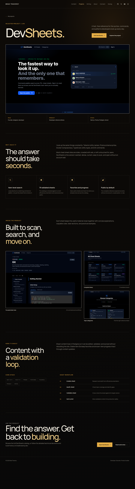

# Feature: Project detail pages

**From build-plan:** feature 4
**Status:** complete

## Goal

Add the reusable project case-study route and publish the approved DevSheets
detail page. Projects without completed case-study content must keep linking to
their live product or devlog destination rather than generating thin internal
pages.

## Design reference



The durable screenshot was captured from the approved local prototype at
`/home/brad/.codex/visualizations/2026/07/25/019f98d0-887e-71e2-a556-09e72e2be0fb/bradtraversy-com-design-options/studio-project-devsheets.html`.
Use it for the detail-page hierarchy, large project title, product stage, facts,
narrative sections, capability grid, gallery, build workflow, CTA, spacing, and
responsive intent. Reuse the production shell, local Manrope files, focus rules,
icons, and mobile menu rather than copying prototype dependencies or scripts.

The approved project-index prototype links only DevSheets to an internal case
study. ApiMocker and the other catalog projects remain external. This is the
initial launch set for this feature.

## In scope

- An explicit optional case-study contract on project entries so internal routes
  exist only for projects with complete case-study content
- A reusable helper that returns case-study projects and the correct primary
  destination for every project
- One initial internal case study at `/projects/devsheets`
- DevSheets story, capabilities, three supporting screenshots, build stack,
  validation workflow, live-product action, and related build-notes action
- A static `/projects/[slug]` route generated only for completed case studies
- A project-detail hero, product stage, facts, story, capability grid, gallery,
  build section, and final CTA matching the approved prototype
- Project-index and homepage links that route DevSheets internally while keeping
  every other project on its existing external destination
- Responsive layouts at 1440px, 760px, and 375px without new client JavaScript
- Accessible headings, navigation state, link names, image alt text, focus
  states, and reduced-motion-safe visual treatments

## Out of scope

- Internal case studies for ApiMocker, SkillPass, PortDoc, AI Blueprint, or
  Vidpipe. They remain eligible through the same contract when their content is
  ready.
- Adding projects beyond the current six-entry catalog
- A CMS, database, project search, filtering, tags, pagination, or runtime data
- MDX integration. The approved initial page can use the repository Markdown
  body plus validated structured frontmatter without adding a dependency.
- Final fact checking, definitive copy, final status and stack labels, exhaustive
  external-link verification, or replacement media. Feature 7 owns that pass.
- Canonical URLs, social cards, sitemap behavior, and performance hardening.
  Feature 8 owns those concerns.
- Related-project carousels, next-project navigation, sharing controls, or
  analytics
- Reworking the shared shell, projects-index composition, or homepage design
  beyond the link behavior needed to expose completed case studies

## Build loop

Build one step at a time, never the whole feature at once.

1. Plan mode lays out the step before any code.
2. The AI implements just that step.
3. It shows the diff, not full files; Brad reads and understands it.
4. Brad approves, then chooses whether to commit a checkpoint or continue.
   Checkpoints are optional; `/complete` creates the feature-level commit.

Never accept a step that has not been reviewed. If a diff is too big to review,
split the step before continuing.

## Build steps

- [x] **Step 1 - Lock the optional case-study contract** - extend the project
  schema with the display title parts, structured section headings, product
  label, workflow steps, CTA copy, gallery labels, and capability icon keys
  required by the approved detail design. Add helpers that return only complete
  case-study entries and resolve each project's primary internal or external
  destination. *Done when:* existing projects without case studies remain valid;
  malformed case-study fields fail Astro content validation; a case-study entry
  without a Markdown body, capabilities, or gallery is rejected with a clear
  build-time error; the helper preserves project order; and `pnpm astro -- sync`
  plus `pnpm build` pass.
- [x] **Step 2 - Seed the DevSheets case study and local gallery** - copy the
  approved Git sheet, full library, and category screenshots into project-owned
  assets, then fill the DevSheets body, capability data, gallery metadata,
  structured case-study sections, build workflow, and devlog URL from the
  approved prototype and current local project narrative. *Done when:*
  DevSheets is the only entry returned by the case-study helper; its body,
  capabilities, gallery, live URL, and build-notes URL are non-empty and
  build-time validated; every image resolves through Astro with descriptive alt
  text; the other five records remain unchanged; and `pnpm build` passes.
- [x] **Step 3 - Generate the detail route and product stage** - add the static
  `/projects/[slug]` route, compose it through `BaseLayout`, and build the
  project-detail hero and stage with the back link, split display title,
  description, live action, story anchor, hero image, role, product type, and
  stack facts. *Done when:* the production build emits
  `/projects/devsheets/index.html` and no detail route for an entry without
  case-study content; the Projects navigation item exposes
  `aria-current="page"`; the page has one `h1`; all hero links and media are
  accessible; the desktop and mobile hierarchy matches the reference; and
  `pnpm build` passes.
- [x] **Step 4 - Build the story and capability section** - render the Markdown
  story body inside the approved editorial section and render the four
  data-driven capability cards with local inline icons. *Done when:* the story
  body renders semantic paragraphs under one named section; capability titles,
  descriptions, and icons come from the collection; the grid uses four columns
  on desktop and stacks without clipping at 760px and 375px; no remote font or
  icon request exists; and `pnpm build` passes.
- [x] **Step 5 - Build the product gallery** - render the approved product
  section and three-image gallery from the validated `gallery` array, including
  visible titles, captions, optimized responsive images, and descriptive alt
  text. *Done when:* the Git sheet is the large lead image; the library and
  category images form the supporting column on desktop; all three stack in
  order on smaller screens; no local asset request fails; and `pnpm build`
  passes.
- [x] **Step 6 - Build the validation workflow and final CTA** - render the
  approved build section with the core stack, four-step sheet workflow, and
  final live-product and optional build-notes actions. *Done when:* all build
  data comes from the DevSheets collection entry; missing optional `devlogUrl`
  removes the build-notes action without an empty link; external links have
  deliberate target behavior and accessible names; the section remains readable
  at all three target widths; and `pnpm build` passes.
- [x] **Step 7 - Connect case studies and finish responsive behavior** - update
  project links on the homepage and projects index to use the shared primary
  destination helper, add an explicit `View project` action for completed case
  studies, and run the final responsive pass. *Done when:* DevSheets media and
  `View project` actions point to `/projects/devsheets`; its live action remains
  external; ApiMocker and the other four projects still use their existing live
  or devlog links; screenshots at 1440 by 900, 760 by 900, and 375 by 812 show
  no overflow or clipped content; keyboard focus is visible; reduced-motion
  rules cover every transition; no application console error or failed local
  request appears; the homepage and projects index regressions pass; and
  `pnpm build` passes.

## Files / areas

- `blueprint/reference/feature-4-project-detail-devsheets.png`
- `blueprint/reference/feature-4-devsheets-1440.png`
- `blueprint/reference/feature-4-devsheets-760.png`
- `blueprint/reference/feature-4-devsheets-375.png`
- `src/content.config.ts`
- `src/content/projects/devsheets.md`
- `src/assets/projects/devsheets-git.png`
- `src/assets/projects/devsheets-all.png`
- `src/assets/projects/devsheets-categories.png`
- `src/lib/projects.ts`
- `src/pages/projects/[slug].astro`
- `src/components/ProjectDetailHero.astro`
- `src/components/ProjectDetailStory.astro`
- `src/components/ProjectDetailSectionHeader.astro`
- `src/components/ProjectDetailGallery.astro`
- `src/components/ProjectDetailBuild.astro`
- `src/components/ProjectDetailCta.astro`
- `src/components/ProjectCapabilityIcon.astro`
- `src/components/FeaturedProjects.astro`
- `src/components/ProjectCatalog.astro`
- `src/components/SelectedProjects.astro`

Create another component only when the detail route uses it immediately. Keep
the page as the route composer and keep each meaningful visual section in one
component. Do not create one-off components for individual facts, workflow rows,
or gallery items.

## Data / contracts

Feature 4 extends the shared project contract without making a case study
mandatory for every project.

```ts
type CapabilityIconName = "search" | "check" | "bookmark" | "unlock";

interface ProjectSection {
  eyebrow: string;
  heading: string;
  accent: string;
}

interface ProjectCaseStudy {
  title: {
    base: string;
    accent: string;
  };
  description: string;
  productLabel: string;
  story: ProjectSection;
  product: ProjectSection & {
    description: string;
  };
  build: ProjectSection & {
    description: string;
    stackLabel: string;
    stack: string[];
    workflowLabel: string;
    workflow: {
      label: string;
      command: string;
      description: string;
    }[];
  };
  cta: ProjectSection & {
    description: string;
  };
}
```

`caseStudy` is optional on `ProjectData`. A generated route requires
`caseStudy`, a non-empty Markdown body, at least one capability, and at least one
gallery image. `Capability` gains a required local icon key when present, and
`MediaAsset` gains an optional display title while retaining its existing
caption.

`getCaseStudyProjects()` returns only complete case-study entries in the existing
catalog order. `getProjectPrimaryHref(project)` returns
`/projects/${project.id}` when `caseStudy` exists and `liveUrl` otherwise. These
helpers keep homepage and project-index behavior aligned as more case studies are
added later.

The Markdown body contains the main story prose. Structured frontmatter supplies
the prototype-specific headings, product gallery, build workflow, and CTA while
remaining reusable for future entries. No case-study copy is hardcoded in a
component.

## Testing

No test command is declared in `AGENTS.md`. This feature adds build-time content
validation, static route generation, and server-rendered UI rather than enough
pure application logic to justify silently adding a test runner.

- Run `pnpm astro -- sync` after the schema changes.
- Run `pnpm build` after every step and before every checkpoint.
- Confirm malformed nested fields and unresolved images fail Astro content
  validation.
- Confirm a marked case study with an empty body, capability list, or gallery
  fails with a clear build-time error.
- Confirm the build emits exactly one detail route,
  `/projects/devsheets/index.html`.
- Confirm the rendered page has one `h1`, unique heading IDs, current Projects
  navigation, named links, valid image dimensions, and descriptive alt text.
- Compare `/projects/devsheets` with the approved detail reference.
- Capture `/projects/devsheets` at 1440 by 900, 760 by 900, and 375 by 812.
- Check the browser console, failed local requests, keyboard focus, and
  reduced-motion behavior.
- Confirm the homepage and projects index still render all six projects and only
  DevSheets gains an internal case-study destination.
- Confirm ungenerated project-detail paths do not appear in built output.

## Notes for the AI

- Preserve the completed Feature 1 shell, Feature 2 homepage, and Feature 3
  project-index design.
- Treat the approved prototype as visual and draft-content authority for this
  feature. Feature 7 still owns public fact, status, stack, copy, media, and
  external-link verification.
- Keep all project and case-study content in the collection. Components receive
  data and render it; they do not contain DevSheets-specific copy.
- Use Astro components, server-rendered HTML, plain CSS, and local image imports.
  Add no client JavaScript or UI framework.
- Do not generate a thin internal page for a project without complete
  case-study content.

## Findings

### 4/F-01 [P2] closed - Hero image sizes uses an invalid CSS variable

**File:** src/components/ProjectDetailHero.astro:51
**Found:** 2026-07-26 by /audit (scope: current)
**Why it matters:** The HTML `sizes` attribute cannot resolve CSS custom
properties. The browser can ignore the intended shell width and choose a larger
image candidate than the layout needs.
**Suggested fix:** Use valid media conditions and concrete `calc()` lengths that
track the shell gutters and maximum content width.
**Resolution:** Replaced the CSS-variable expression with valid responsive
lengths that match the production shell. Re-review confirmed the invalid
expression is gone, Astro sync and build pass, and desktop and mobile browser
screenshots remain pixel-identical.

### 4/F-02 [P2] closed - Detail section heading composition is duplicated

**File:** src/components/ProjectDetailStory.astro:17
**Found:** 2026-07-26 by /audit (scope: current)
**Why it matters:** Story, gallery, and build repeat the same heading markup,
typography, prose treatment, breakpoint, and spacing. A visual adjustment can
drift across three otherwise aligned sections.
**Suggested fix:** Extract the repeated heading and prose layout into one shared
project-detail component used immediately by all three sections.
**Resolution:** Added `ProjectDetailSectionHeader.astro` and composed it into the
story, gallery, and build sections. Re-review confirmed all three consumers use
the shared component, the build passes, and desktop and mobile browser
screenshots remain pixel-identical.
