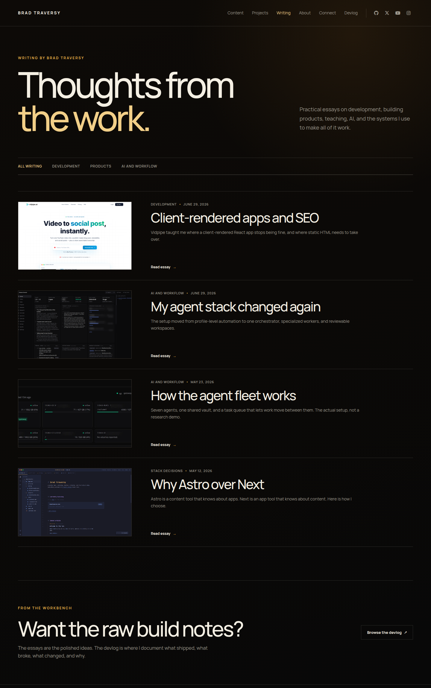

# Feature: Writing collection and index

**From build-plan:** feature 5
**Status:** complete

## Goal

Define the repository-backed writing collection, migrate the homepage writing
preview onto that shared data, and build the approved `/writing` index as a clean
single-column list.

The collection must be ready for both internal essays and externally hosted
writing, while the initial entries remain external until Feature 6 creates real
internal article routes. No content entry should point at a local route that does
not exist yet.

## Design reference



The durable screenshot was captured from the approved local prototype at
`/home/brad/.codex/visualizations/2026/07/25/019f98d0-887e-71e2-a556-09e72e2be0fb/bradtraversy-com-design-options/studio-blog.html`.
Use it for the editorial hero, subject anchor strip, direct recent-writing flow,
left-thumbnail and right-content rows, fine separators, workbench CTA, spacing,
and responsive intent. Reuse the production shell, local Manrope files, focus
rules, icons, and mobile navigation rather than copying prototype dependencies
or scripts.

The approved direction intentionally omits an oversized featured-story block.
Writing should flow directly from the page introduction into the article list.

## In scope

- An Astro content collection for writing with validated titles, descriptions,
  dates, topics, local cover media, homepage feature state, and optional external
  destinations
- A contract that distinguishes internal entries by the absence of
  `externalUrl`, requires internal body content, and rejects body content on an
  external entry
- Deterministic newest-first ordering with a stable title tie-breaker
- Exactly one featured entry for the existing homepage composition
- One initial four-entry catalog based on the approved prototype, with every
  initial destination remaining external until Feature 6
- Four project-owned writing cover assets copied from the approved local
  prototype
- Migration of the homepage featured article and two supporting rows from
  `HOMEPAGE_ARTICLES` to the shared writing collection
- A static `/writing` route with the approved hero, data-driven subject anchors,
  one-column article list, and final bradtraversy.dev workbench CTA
- Destination helpers that return the future internal route or current external
  URL and make external target behavior explicit
- Responsive layouts at 1440px, 760px, and 375px without new client JavaScript
- Accessible headings, navigation state, link names, image alt text, focus
  states, and reduced-motion-safe image treatment

## Out of scope

- Generated `/writing/[slug]` routes, MDX integration, full internal essay
  bodies, article typography, or next-entry navigation. Feature 6 owns them.
- Converting any initial entry to an internal article before Feature 6 creates
  its route
- Final fact checking, definitive article copy, final dates and topics,
  replacement cover media, or exhaustive external-link verification. Feature 7
  owns that pass.
- Interactive topic filtering, search, tags, pagination, sorting controls, or
  client-side state. The subject strip is anchor navigation only.
- RSS, canonical URLs, social metadata, sitemap behavior, and performance
  hardening. Feature 8 owns them.
- A CMS, database, drafts workflow, comments, likes, reading progress, or
  analytics
- Reworking the shared shell, project pages, homepage writing composition, or
  mobile menu beyond replacing the homepage preview data source

## Build loop

Build one step at a time, never the whole feature at once.

1. Plan mode lays out the step before any code.
2. The AI implements just that step.
3. It shows the diff, not full files; Brad reads and understands it.
4. Brad approves, then chooses whether to commit a checkpoint or continue.
   Checkpoints are optional; `/complete` creates the feature-level commit.

Never accept a step that has not been reviewed. If a diff is too big to review,
split the step before continuing.

## Build steps

- [x] **Step 1 - Lock the writing collection contract and seed content** - add
  the `writing` collection schema, four initial Markdown entries, and four local
  cover assets from the approved prototype. Keep every initial entry external,
  with the first entry marked for the homepage feature position. *Done when:*
  Astro-generated types expose the collection; required text, dates, URLs,
  booleans, and local images are build-time validated; malformed frontmatter,
  invalid dates, invalid URLs, and unresolved images fail with clear content
  errors; exactly four entries exist; every cover has descriptive alt text; and
  `pnpm astro -- sync` plus `pnpm build` pass.
- [x] **Step 2 - Add catalog helpers and migrate the homepage** - add the shared
  writing types, newest-first catalog loader, featured-entry validation, body
  contract validation, unique topic list, and destination helper, then replace
  `HomepageArticle` and `HOMEPAGE_ARTICLES` with collection data in
  `FeaturedWriting.astro`. *Done when:* the catalog returns all four entries in
  deterministic date and title order; exactly one featured entry is required;
  an external entry with body content and an internal entry without body content
  both fail clearly; the homepage renders one featured and two supporting
  entries from the collection; all initial homepage destinations remain
  external; no writing record remains duplicated in `home.ts`; and `pnpm build`
  passes.
- [x] **Step 3 - Build the writing route, hero, anchors, and workbench CTA** - add
  `/writing` through `BaseLayout`, compose the editorial hero and data-driven
  subject anchor strip, and add the final bradtraversy.dev workbench CTA. *Done
  when:* `/writing` renders through the production shell; the Writing navigation
  item exposes `aria-current="page"`; the page has one `h1`; topic anchors are
  unique and expose normalized fragment hrefs; the devlog CTA is
  named and external; the desktop and mobile hierarchy matches the reference;
  and `pnpm build` passes.
- [x] **Step 4 - Build the direct writing list** - render every sorted collection
  entry as one left-thumbnail and right-content row with topic, date, title,
  description, image link, and named text action. Use the shared destination
  helper for internal-ready and external entries without generating article
  pages early. *Done when:* all four entries render once in approved order;
  desktop rows align media and copy across one column; image and text links agree
  on their destination; every topic fragment points to the first matching row;
  external links use deliberate target and relationship attributes; all images
  expose valid dimensions and alt text; no dead local
  article route is emitted; and `pnpm build` passes.
- [x] **Step 5 - Finish responsive behavior and regressions** - tune the hero,
  subject anchors, article rows, and CTA at all target widths, then verify the
  homepage migration and shared shell. *Done when:* each article stacks its
  image above its content at 760px and 375px; screenshots at 1440 by 900, 760 by
  900, and 375 by 812 show no overflow or clipped content; keyboard focus is
  visible; reduced-motion rules cover every transition; no application console
  error or failed local request appears; `/`, `/projects`,
  `/projects/devsheets`, and `/writing` regressions pass; the homepage still
  shows three writing previews; and `pnpm build` passes.

## Files / areas

- `blueprint/reference/feature-5-writing-index.png`
- `src/content.config.ts`
- `src/content/writing/`
- `src/assets/writing/`
- `src/lib/writing.ts`
- `src/data/home.ts`
- `src/components/FeaturedWriting.astro`
- `src/components/WritingHero.astro`
- `src/components/WritingList.astro`
- `src/components/WritingWorkbenchCta.astro`
- `src/pages/writing/index.astro`

Create another component only when the writing route uses it immediately. Keep
the route as the page composer, keep repeated article records in the collection,
and render the repeated rows inside `WritingList.astro` rather than creating a
one-off component for each article.

## Data / contracts

Feature 5 locks the writing contract consumed by the homepage, writing index,
Feature 6 article routes, and later RSS generation.

```ts
interface WritingData {
  title: string;
  description: string;
  publishDate: Date;
  topic: string;
  cover: {
    src: ImageMetadata;
    alt: string;
    caption?: string;
  };
  externalUrl?: string;
  featured: boolean;
}

interface WritingCatalog {
  entries: WritingEntry[];
  featured: WritingEntry;
  supporting: WritingEntry[];
  topics: {
    label: string;
    id: string;
  }[];
}

interface WritingDestination {
  href: string;
  external: boolean;
}
```

The Markdown filename becomes the Astro entry `id` and future route segment, so
there is no separate frontmatter slug that can drift. `getWritingCatalog()` sorts
by `publishDate` descending, then `title` ascending, and rejects a catalog
without exactly one featured entry. Its `supporting` list excludes the featured
entry while preserving the same sort order.

An entry with `externalUrl` is external and must have an empty Markdown body. An
entry without `externalUrl` is internal and must have a non-empty body.
`getWritingDestination(entry)` returns the external URL for an external entry
and `/writing/${entry.id}` for an internal entry, with an `external` flag so
components apply target behavior consistently. Feature 5 seeds only external
entries, so no internal destination is exposed before Feature 6 builds the
route.

The topic list is derived from the sorted entries, preserves first appearance,
and assigns one normalized unique anchor ID per topic. Catalog loading rejects a
topic that normalizes to an empty ID or collides with a different topic label.
The subject strip provides navigation within the current page, not a filter.

The initial catalog contains:

1. `Client-rendered apps and SEO`
2. `My agent stack changed again`
3. `How the agent fleet works`
4. `Why Astro over Next`

The prototype supplies draft titles, descriptions, dates, topics, media, and
destinations for this structural feature. Feature 7 remains responsible for
final public accuracy.

## Testing

No test command is declared in `AGENTS.md`. This feature adds build-time content
validation, static rendering, and small repository helpers without silently
installing a test runner.

- Run `pnpm astro -- sync` after adding the collection.
- Run `pnpm build` after every step and before every checkpoint.
- Confirm malformed required fields, dates, external URLs, and local image paths
  fail Astro content validation.
- Confirm catalog loading rejects zero or multiple featured entries, external
  entries with body content, internal entries without body content, and empty or
  colliding normalized topic IDs.
- Confirm the production build emits `/writing/index.html` and no
  `/writing/[slug]` output yet.
- Confirm the index contains exactly four entries in deterministic newest-first
  order and the homepage contains one featured plus two supporting entries.
- Confirm one `h1`, unique heading and topic IDs, current-route navigation, named
  links, valid image dimensions, and descriptive alt text in the rendered DOM.
- Compare `/writing` with
  `blueprint/reference/feature-5-writing-index.png`.
- Capture `/writing` at 1440 by 900, 760 by 900, and 375 by 812.
- Check the browser console, failed local requests, keyboard focus, and
  reduced-motion behavior.
- Confirm no remote font, icon, or image request exists.
- Regression-check `/`, `/projects`, and `/projects/devsheets`.

## Notes for the AI

- Preserve the completed production shell, homepage, project index, and DevSheets
  detail page.
- Use the approved prototype as structural and draft-content authority, not as
  final factual authority.
- Use Astro content collections, server-rendered HTML, plain CSS, and local image
  imports. Add no client JavaScript or UI framework.
- Keep all writing content and media metadata in the collection. Components
  receive data and render it; they do not contain article-specific copy.
- Keep the initial four entries external until Feature 6 adds MDX support and
  internal article routes.
- Do not add a featured-story block, topic filtering, or other content discovery
  behavior absent from this feature.
