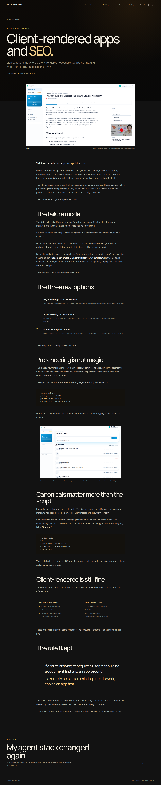

# Feature: Article pages

**From build-plan:** feature 6
**Status:** complete

## Goal

Add the reusable internal-article route and publish the approved
`Client-rendered apps and SEO` essay as the first repository-owned MDX article.
External writing entries must keep their external destinations, while internal
entries gain the approved article hero, optimized media, readable long-form body,
structured content blocks, and next-entry navigation.

## Design reference



The durable screenshot was captured from the approved local prototype at
`/home/brad/.codex/visualizations/2026/07/25/019f98d0-887e-71e2-a556-09e72e2be0fb/bradtraversy-com-design-options/studio-blog-post.html`.
Use it for the back link, article metadata hierarchy, oversized title, constrained
hero media, caption treatment, readable body measure, structured options and
comparison blocks, inline figure, blockquote, next-essay CTA, spacing, and
responsive intent. Reuse the production shell, local Manrope files, focus rules,
icons, and mobile navigation rather than copying prototype dependencies or
scripts.

The prototype contains one duplicated paragraph in its source. The production
MDX entry must include that paragraph once.

## In scope

- The official Astro MDX integration and content-loader support for both Markdown
  and MDX writing entries
- An optional internal-article metadata contract covering article type, public
  tags, optional title accent, and distinct optimized hero media with a label and
  caption
- Validation that internal entries require body and article metadata, external
  entries reject both, and an article title accent matches the end of its public
  title
- Shared internal-entry narrowing, internal route selection, deterministic
  following-entry selection, and the existing destination helper
- A static `/writing/[slug]` route generated only for complete internal entries
- Reusable article hero, cover, prose, inline-figure, comparison, and next-entry
  components built from plain Astro and CSS
- One internal MDX essay at
  `/writing/client-rendered-apps-and-seo`, based on the approved prototype body
- Two project-owned article images copied from the approved local prototype
- Homepage and writing-index destinations changing automatically from the former
  external URL to the new internal route through the shared destination helper
- Next-entry navigation from the internal essay to the following catalog entry,
  with deliberate external-link behavior when that entry remains external
- Responsive layouts at 1440px, 760px, and 375px without new client JavaScript
- Accessible headings, landmarks, link names, image alt text, captions, focus
  states, semantic prose, and reduced-motion-safe treatments

## Out of scope

- Converting `My agent stack changed again`, `How the agent fleet works`, or
  `Why Astro over Next` into internal essays. They remain external until final
  bodies are approved.
- Inventing additional essays, author profiles, reading-time estimates, related
  article algorithms, table-of-contents behavior, share controls, comments,
  reactions, progress tracking, or search
- Final fact checking, definitive article copy, final dates, topics, tags, or
  replacement media. Feature 7 owns that pass.
- Canonical URLs, Open Graph metadata, social cards, sitemap behavior, RSS, and
  performance hardening. Feature 8 owns them.
- A CMS, database, drafts workflow, preview service, runtime content loading, or
  client-side MDX rendering
- Reworking the shared shell, writing index, homepage composition, project pages,
  or mobile menu beyond the destination change caused by the new internal entry

## Build loop

Build one step at a time, never the whole feature at once.

1. Plan mode lays out the step before any code.
2. The AI implements just that step.
3. It shows the diff, not full files; Brad reads and understands it.
4. Brad approves, then chooses whether to commit a checkpoint or continue.
   Checkpoints are optional; `/complete` creates the feature-level commit.

Never accept a step that has not been reviewed. If a diff is too big to review,
split the step before continuing.

## Build steps

- [x] **Step 1 - Add MDX and lock the internal-article contract** - install and
  configure the official Astro MDX integration, let the writing loader accept
  `.md` and `.mdx`, add optional article display metadata to the schema, add
  internal-entry guards and following-entry helpers, and copy the approved hero
  and inline article assets. Keep all four entries external during this step.
  *Done when:* Astro loads existing Markdown entries unchanged; MDX is configured;
  external entries with body or article metadata fail clearly; internal entries
  without body or article metadata fail clearly; an invalid title accent fails;
  internal-entry narrowing and next-entry selection preserve catalog order; both
  article images are valid local assets; `pnpm astro -- sync` and `pnpm build`
  pass; and no article route is emitted yet.
- [x] **Step 2 - Build the article route, hero, and cover** - add the internal-only
  static route and compose reusable article hero and cover components through
  `BaseLayout`. The route may have no generated paths until Step 4 supplies the
  first complete internal entry. *Done when:* static paths are sourced only from
  narrowed internal entries; the route uses the writing entry ID as its segment;
  the production shell and Writing navigation state are preserved; the route has
  one article-title `h1`, a named back link, author/date/tag metadata, one
  optimized hero image, and a semantic caption; empty internal-path output is
  accepted before content conversion; and `pnpm build` passes.
- [x] **Step 3 - Add long-form prose and structured article composition** - add
  the constrained article-body wrapper, standard Markdown treatments, one
  reusable optimized inline figure, one reusable two-column comparison, and the
  following-entry CTA, then compose them into the route. *Done when:* ordinary
  MDX paragraphs, headings, strong text, inline code, code blocks, ordered lists,
  and blockquotes receive the approved typography without article-specific CSS;
  the figure and comparison receive their content through typed props; the
  comparison stacks below 760px; the next CTA supports internal and external
  destinations plus a no-next fallback; no client JavaScript is added; and
  `pnpm build` passes.
- [x] **Step 4 - Publish the first internal MDX essay** - convert
  `client-rendered-apps-and-seo` from an external Markdown record into the
  complete internal MDX article, add its article display metadata, and reproduce
  the approved body once without the prototype's duplicated paragraph. *Done
  when:* exactly one internal article route is generated; the other three entries
  remain external and generate no local routes; homepage and index links for the
  converted entry resolve internally; the article renders every approved prose
  section, numbered option, route block, inline figure, comparison, rule
  blockquote, and external next-entry CTA; all local images expose dimensions and
  descriptive alt text; rendered headings are unique and ordered; and
  `pnpm build` passes.
- [x] **Step 5 - Finish responsive behavior and regressions** - tune the article
  hierarchy, body measure, media, structured blocks, and next CTA at all target
  widths, then verify the writing index, homepage, and existing project routes.
  *Done when:* screenshots at 1440 by 900, 760 by 900, and 375 by 812 match the
  approved responsive intent without page overflow or clipped prose; the cover,
  inline figure, options, comparison, blockquote, and next CTA remain readable;
  keyboard focus is visible; reduced-motion rules cover every transition; no
  application console error or failed local request appears; `/`, `/projects`,
  `/projects/devsheets`, `/writing`, and the internal article route regressions
  pass; external writing destinations remain deliberate; and `pnpm build`
  passes.

## Files / areas

- `astro.config.mjs`
- `package.json`
- `pnpm-lock.yaml`
- `blueprint/reference/feature-6-article-page.png`
- `src/content.config.ts`
- `src/content/writing/client-rendered-apps-and-seo.mdx`
- `src/assets/writing/vidpipe-article.png`
- `src/assets/writing/vidpipe-dashboard.png`
- `src/lib/writing.ts`
- `src/components/ArticleHero.astro`
- `src/components/ArticleCover.astro`
- `src/components/ArticleProse.astro`
- `src/components/ArticleFigure.astro`
- `src/components/ArticleComparison.astro`
- `src/components/ArticleNext.astro`
- `src/pages/writing/[slug].astro`

Create another component only when the article route or its MDX content uses it
immediately. Keep article-specific prose and structured values in the MDX entry.
Reusable components own layout, semantics, and shared styling only.

## Data / contracts

Feature 6 extends the writing contract without changing external entries:

```ts
interface WritingArticleData {
  type: string;
  tags: string[];
  titleAccent?: string;
  hero: {
    src: ImageMetadata;
    alt: string;
    label: string;
    caption: string;
  };
}

interface WritingData {
  title: string;
  description: string;
  publishDate: Date;
  topic: string;
  cover: MediaAsset;
  externalUrl?: string;
  featured: boolean;
  article?: WritingArticleData;
}
```

An external entry has `externalUrl`, no article metadata, and an empty body. An
internal entry has no `externalUrl`, complete article metadata, and a non-empty
MDX body. Catalog loading rejects mixed or incomplete states. If
`article.titleAccent` is present, the public `title` must end with it so the
hero can emphasize the suffix without duplicating a second display title.

`InternalWritingEntry` is the narrowed collection-entry type used by static
article routes. `getInternalWritingEntries(entries)` preserves catalog order and
returns only complete internal entries. `getNextWritingEntry(entries, entry)`
returns the following item in that same order without wrapping or returning the
current entry. The next component uses `getWritingDestination()`, so an external
following entry keeps explicit target and relationship attributes. When no next
entry exists, it links back to `/writing` instead of rendering a dead control.

The first internal entry is `client-rendered-apps-and-seo`. Its article metadata
uses the approved Decision type, React tag, SEO accent, and distinct Vidpipe hero
media. The remaining three entries keep their current external URLs.

## Testing

No test command is declared in `AGENTS.md`. This feature adds content validation,
small deterministic helpers, static rendering, and UI composition without
silently installing a test runner.

- Run `pnpm astro -- sync` after configuring MDX and after converting the entry.
- Run `pnpm build` after every step and before every checkpoint.
- Confirm external entries reject body and article metadata, internal entries
  reject missing body or article metadata, and an invalid title accent fails.
- Confirm the internal filter and next-entry helper preserve the existing sorted
  order and handle an absent current or following entry without a self-link.
- Confirm the production build emits exactly
  `/writing/client-rendered-apps-and-seo/index.html` and no route for the three
  external entries.
- Confirm homepage, writing-index image, writing-index text, and article-next
  destinations agree with the shared destination helper.
- Confirm one `h1`, ordered headings, named links, valid image dimensions,
  descriptive alt text, captions, and semantic article content in the rendered
  DOM.
- Compare the internal article route with
  `blueprint/reference/feature-6-article-page.png`.
- Capture the article at 1440 by 900, 760 by 900, and 375 by 812.
- Check the browser console, failed local requests, keyboard focus, reduced-motion
  behavior, and horizontal overflow.
- Confirm no remote font, icon, image, or content request exists.
- Regression-check `/`, `/projects`, `/projects/devsheets`, and `/writing`.

## Notes for the AI

- Preserve the completed production shell, homepage, project routes, and writing
  index design.
- Use the approved prototype as visual and draft-content authority. Feature 7
  still owns final public accuracy and link verification.
- Use Astro content collections, server-rendered MDX, Astro components, plain CSS,
  and local image imports. Add no client-side article JavaScript or UI framework.
- Keep article-specific copy, option values, route examples, comparison values,
  and captions in the MDX entry or validated entry metadata.
- Keep the three unconverted writing entries external and do not fabricate their
  bodies.
- Do not add discovery metadata that Feature 8 owns.
